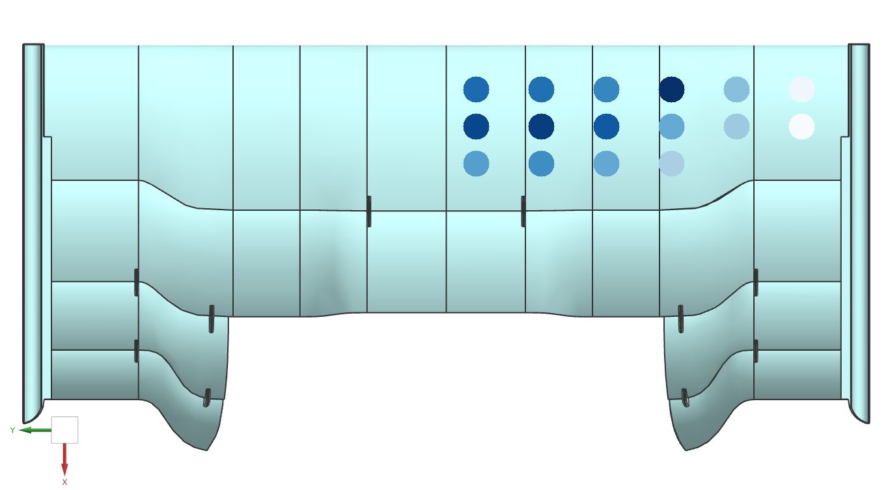

# 🏎️ FSG Pressure Sensor Analysis - Proof of Concept

## 🔬 Concept Overview  
This project serves as a **proof of concept** for processing and analyzing pressure sensor data from a Formula Student Germany (FSG) vehicle. It demonstrates a complete workflow from raw telemetry data to aerodynamic validation through:

- Sensor data ingestion and cleaning  
- Vehicle velocity derivation  
- Pressure distribution analysis  
- Visual mapping onto aerodynamic surfaces  

Developed to validate testing methodologies for FSG aerodynamic packages.

---

## 🧰 Technical Implementation  

### Core Components  
| Component | Implementation                 | Purpose                         |  
|-----------|--------------------------------|---------------------------------|  
| **Data Pipeline** | `pandas` + `numpy`             | Process pressure sensor data    |  
| **Velocity Model** | Gear ratio mapping             | Derive speed from RPM telemetry |  
| **Normalization** | Mean normalization             | Standardize sensor baselines    |  
| **Visualization** | `matplotlib` + `opencv-python` | Map pressures to wing geometry  |  

---

## 📊 Results achieved: 

### Real Life Data Visualized vs. Simulation Results
  
*Processed sensor data mapped to wing profile*

*Simulation results*

---

### 📜 License
Proprietary - AGH Racing Internal Use
